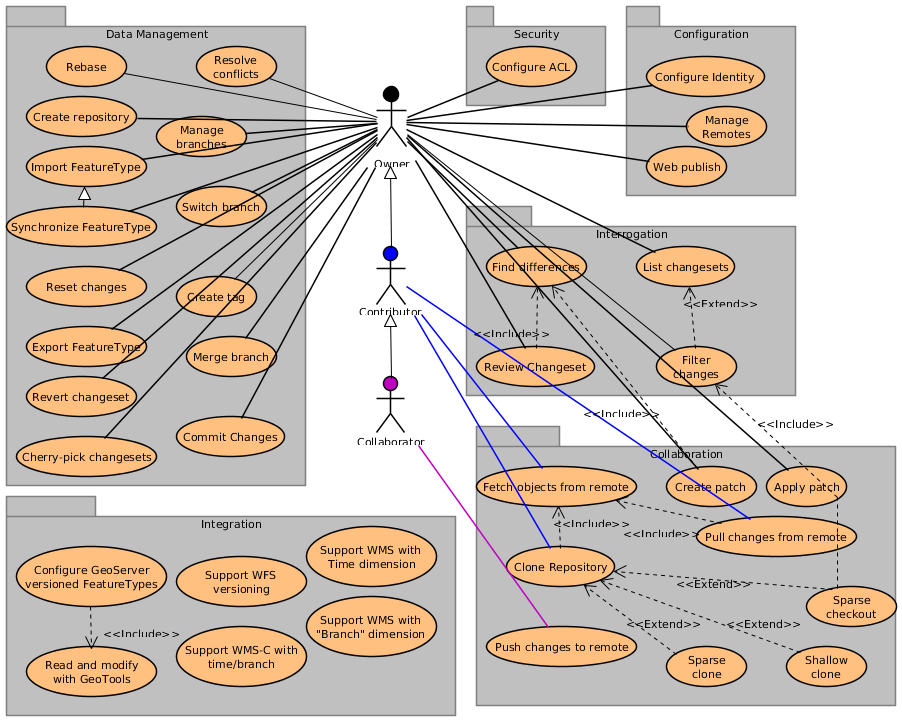

.. _srs:

Software Requirements Specification
###################################

This SRS precisely defines the software product that will be built. Decisions made in writing the SRS are based on information in the :ref:`proposal` and :ref:`user_needs` documents. The SRS sets requirements that must be satisfied by the system design. The SRS is verified and validated by activities outlined in the :ref:`qa_plan`.

Actors
******

.. _Owner:

Owner
=====

Every GeoGit user is an owner of his own repositories. As such, an Owner can create and manage repositories, set them up online for sharing, grant and revoke access to collaborators.

.. _Contributor:

Contributor
===========

A Contributor is an Owner that also has read-only access to other Owners repositories. As such, it can clone, sparse-clone, or fetch data from remote repositories not owned by him, incorporate others changes to its own repository. A Contributor is not allowed to modify a remote repository he doesn't own in any way. It can send patches to the repository owner, and when/if applied, proper credit is given to the Contributor as the commit's "author", while whomever performed the commit will be the "committer".

.. _Collaborator:

Collaborator
============

A Collaborator is a Contributor for a remote repository not owned by himself, that also has permission to directly modify the repository through a "push" operation. "Push" operations on remote repositories are used to apply changesets between branches in the local and remote repository with common history (fast forward), and can also be used to upload new branches, tags, or delete them.

Use Cases
*********

For more detail see:

.. toctree:: :maxdepth: 2 

    use_case_suite

Functional Requirements
***********************

Non-Functional Requirements
***************************
..  non-functional requirement is a requirement that specifies criteria that can be used to judge the operation of a system, rather than specific behaviors. This should be contrasted with functional requirements that define specific behavior or functions. The plan for implementing functional requirements is detailed in the system design. The plan for implementing non-functional requirements is detailed in the system architecture.

Usability requirements
======================

Our main criteria for making the system usable is the difficulty of performing each high-frequency use case. Difficulty depends on the number of steps, the knowledge that the user must have at each step, the decisions that the user must make at each step, and the mechanics of each step (e.g., typing a book title exactly is hard, clicking on a title in a list is easy).

The user facing interfaces (CLI, Java and REST APIs) should be as familiar as possible to users who have used other similar interfaces. Extensive on-line help should be provided.

Error messages should be informative enough as to give the user a clear indicatio of what inputs are erroneous, or aid in identifying bugs.

API contracts shall be clearly defined, documented, and enforced.

Reliability and up-time requirements
====================================

**TBD**

Safety requirements
===================

See :term:`Usability > Safety`

The combination of easy branching, diff'ing, and merging, and cryptographic hashing of every object in the repository, should make for easily correcting any mistake. When wanting to revert the last commit on a branch, the `reset` operation can revert the HEAD to the previous commit (or any previous commit). When changes that were committed prior to the last one, and the last one needs to stay, the `revert` operation should produce a "counter-patch" that reverts the effect of the unwanted commits.

Security requirements
=====================

Users of loccal repositories have full access to them. Authentication and authorization to access and change remote repositories is to be considered an orthogonal concern, and is not a requirement at this stage of the project life cycle.

It is anticipated, though, that a security layer, either in form of a proxy or :term:`AOP` advisors would form a security barrier to access a remote repository.

It should be possible to configure a remote repository through :term:`SSL`, so that data transfer is encrypted.

Performance and scalability requirements requirements
=====================================================

**TBD**

Maintainability and upgradability requirements
==============================================

Maintainability is our ability to make changes to the product over time. We need strong maintainability in order to retain our early adopters. We will address this by anticipating several types of change, and by carefully documenting our design and implementation.

Upgradability is our ability to cost-effectively deploy new versions of the product to customers with minimal downtime or disruption.

Version upgrades to server side product should remain compatible with client side product that hasn't upgraded for at least two minor versions (e.g. `0.5.0` API should remain compatible with at least `0.4.0` and `0.3.0`). Versioning of the :ref:`REST <requirements_apis>` API and a complete set of unit and integration tests for each API version would do fine.

Also, we shall use data formats that include enough meta-data to allow us to reliably transform existing customer data during an upgrade.

Supportability and operability requirements
===========================================

Supportability is our ability to provide cost effective technical support.

* Product upgrades should be easy and backwards compatible.
* The user guide and product documentation will include a troubleshooting guide and checklist of information to have at hand before contacting technical support.

Operability is our ability to host and operate the software as an ASP (Application Service Provider).

The server side product features should help us achieve our goal of 99.9% uptime (at most 43 minutes downtime each month). Key features supporting that are the ability to do hot data backups, and application monitoring.

Environmental Requirements
**************************

The following environmental requirements describe the larger system of hardware, software, and data that this product must work within.

System hardware requirements
============================

* Desktop commodity computers (Intel Core i5 and the like)
* Low to High-end servers with more than 8 cores
* :term:`Android` devices with at least double-core processors and 512MB of RAM

System software requirements
============================

Required:
 * A Java 6 rutime environment (Oracle's or OpenSDK).
 * A contemporary Operating System (e.g. Linux kernel 2.6+, Windows XP+, MacOS X+) where a full Java 6 runtime environment is available.
 * A Java library that provides Geometry and geometry operations (e.g. `JTS <http://en.wikipedia.org/wiki/JTS_Topology_Suite>`_)
 * A Java library that provides Coordinate Reference Systems and Coordinate Transformation Services (e.g. `GeoTools <http://geotools.org/>`_, `Proj4J <http://trac.osgeo.org/proj4j/>`_)
 * A high performant and embeddable key-value database that scales to the expected amount of data for each running environment (e.g. `BDB JE <http://www.oracle.com/technetwork/database/berkeleydb/overview/index-093405.html>`_, `OriendDB <http://www.orientdb.org/>`_)

Desired:
 * Android java runtime
 * Android 2.1+.

.. _requirements_apis:

Application program interfaces (APIs)
=====================================

* A `"low level" <https://github.com/opengeo/GeoGit/issues/15>`_ (plumbibg) Java API. The interface (input, output, set of options and the semantics) to these low-level operations are meant to be a lot more stable than "Porcelain" level commands, because these commands are primarily for internal programmatic use. The interface to Porcelain commands on the other hand are subject to change in order to improve the end user experience.

* A `"high level" <https://github.com/opengeo/GeoGit/issues/16>`_ (porcelain) Java API that provides a more user-friendly interface to the plumbing API (e.g. log, commit, pull, push, etc).

* A Java API for scripting purposes, probably just made up of the `plumbing` and `porcelain` API.

* A :term:`REST` API that provides for the remote invocation of operations to support interrogation and repository synchronization commands between a local and a remote repository; as well as alternate representations for interrogations from "lightweight" (e.g. HTML+JavaScript) clients.

Data import and export requirements
===================================

The system will support importing and exporting dataset snapshots from and to common geospatial data formats and major geospatial databases. Exporting to and importing from :term:`shapefile` and :term:`PostGIS` is required. :term:`Oracle Spatial`, :term:`FGDB`, and :term:`ArcSDE` is desired but non blocker.

