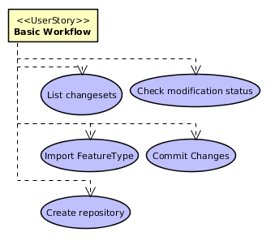
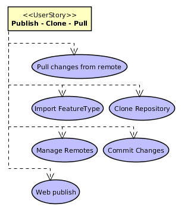
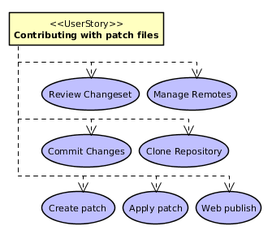
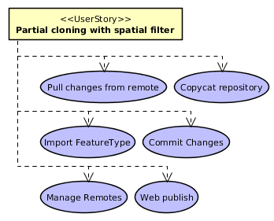
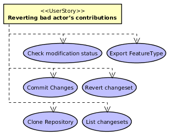
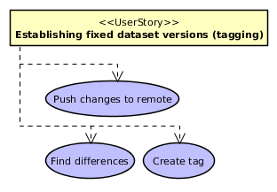
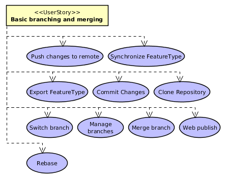
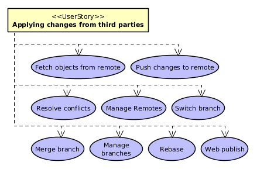
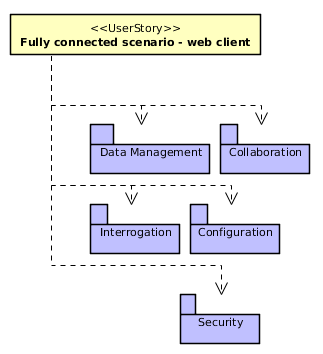
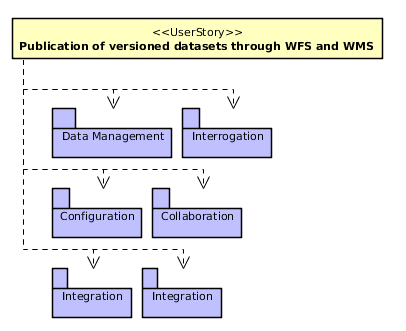

.. _user_needs:

User Needs
##########

The statement of user needs documents and explains the actual desires of stakeholders in roughly their own words. What they desire is never exactly what the product provides. Documenting user needs here, independently from the SRS, helps to keep the SRS precise and makes the tasks of verification and validation more effective. This document is not an informal draft of the SRS, it is different document with a complementary purpose.

Agreed Goals
************

All stakeholders have agreed on the :ref:`general_project_goals`.

.. _user_stories:

User Stories
************

.. _user_story_01:

User Story 01: **Basic workflow**
=================================

Lorenzo initializes an empty repository `repo1` on a local machine and imports data from three shapefiles: `roads`, `rivers`, and `buildings`, into it, using the `geogit` command line to first initialize the repository on an empty directory and then the `import` command to copy the shapefiles into the "working tree".

Once done the `status` command reports the features that have been added yet not staged for commit.

Lorenzo uses the `add` command to stage the changes and then provides a commit message to the `commit` command which effectively adds the features to the repository on the master branch.

Finally, Lorenzo confirms the commit has been achieved using the `log` command, which prints this single `commit` information, such as commit identifier, timestamp, commit message, and Lorenzo's configured name and email address as the author of the changeset.

Next step Lorenzo adds, removes and modifies some features to the three original shapefiles using QGis.

When done, he re-runs the `import` command for each of the shapefiles.

Using the `status` command he can see the ids of the features that have been added, removed, and deleted on each feature type. Decides to ditch the changes made to the `roads` feature type, so uses the `checkout` command to re-establish the repository version of the modified roads onto the working tree. Now, in order to provide different commit messages to the changes made to each of the reminding feature types, uses the `add` command with the path to the `buildings` feature type to stage the changes made to buildings and the `commit` message to effectively persist those changes to the repository, and finally does the same for the changes made to the `rivers` feature type.

**Related Use Cases:**

------

.. _user_story_02: 

User Story 02: **Publish - Clone - Pull**
=========================================

Alice initializes and empty local repository `chile_osm` and imports a whole country worth of data (nodes/ways) from OSM. After that configures the `GeoGit` web application to publish the `chile_osm` repository on the Internet. Having not configured any access control, the repository is read-only for everyone, but nobody other than Alice have write access to it.

Ben is given the publication URL for the `chile_osm` repository and clones it to his local machine. After cloning, the remote repository is automatically configured by the name `origin`.

Alice performs a couple commits to the repository, then Ben uses the geogit `pull` command with the name of the remote repository as argument to fetch Alice's changes to his clone. The GeoGit command line interface notifies Ben that the `master` branch has been synchronized with the upstream version, and how many changes to features have been recorded.

**Related Use Cases:**

------

.. _user_story_03:

User Story 03: **Contributing with patch files**
================================================

John has cloned Ben's repository and made a bunch of changes to a couple feature types, but he doesn't have write permissions to Ben's repository. So John uses the GeoGit `diff` tool to prepare a `"patch file"` that he sets to Ben by email.

This patch file is in a GeoGit specific format and contains the differences between the two repository snapshots that John chose when preparing it.

The patch file works as a single changeset, regardless of how many commits were between the two chosen points in history. Still, when creating the patch file, an optional commit message can be provided so that when the remote repository owner applies it, GeoGit knows what the original patche's author intention was. Additionally, the GeoGit automatically set the author name and email address as part of the patch file metadata.

When Rob receives the patch file, he first checks whether the patch would cleanly apply to his working tree, and if so, he applies the patch. The resulting commit names John as the author of the changeset and Ben as the committer. If the patch file didn't contain a commit message, Ben has to provide one. Or if it did contain a commit message Ben can chose to ignore it and provide one he things applies better.

**Related Use Cases:**

------

.. _user_story_04:

User Story 04: **"Partial cloning" with spatial filter**
========================================================

The Organization maintains a whole country worth of data.

For a field survey over a specific city, fully cloning that repository is un-practical due to the size of the repository.

So, a "partial clone" (note the oximoron) is performed by passing a spatial filter to the GeoGit `clone` command. This spatial filter indicates an intersection relationship with a geometry literal given to the command as WKT using ECQL.

GeoGit then fetches only the objects from the remote repository who'se geometry matches the given spatial filter.

As a result, the new local repository is completely different than the original one:

* commits that do not satisfy the spatial filter are completely ignored and so the objects referenced by such commits

* commits that partially satisfy the spatial filter are fetched, but only the features changed that do satisfy the spatial filter are fetched

Yet the new 'sparse cloned' repository contains enough metadata information as to know how to reconcile its information with the "upstream" repository.

When the field worker comes back with changes on the 'sparse cloned' repository, she can pull from, and push to, the upstream repository as easily as if it were a normal `clone`.

**Related Use Cases:**

------

.. _user_story_05:

User Story 05: **Reverting bad actor's contributions**
======================================================

The Organization maintains a repository of city roads that is collaboratively built (crowdsourced). co An assessment of the repository state reveals that one collaborator has committed several changesets where the roads are clearly taken from Google Maps, as they match perfectly when overlaid, and for legal reasons those changes can't be part of this public repository.

A decision is taken that all commits from that user have to be reverted.

`GeoGit`'s `log` command with a filter on the author's name is used to obtain the list of all the commits from this contributor.

With that list at hand, the `revert` command with an option not to automatically commit the "reverse patch" is used for each offending commit.

When finished, all the changes from the bad actor are staged and the whole reverse patch is applied with a single commit.

**Related Use Cases:**

------

.. _user_story_06:

User Story 06: **Establishing fixed dataset versions (tagging)**
================================================================

A company maintains a whole city worth of data in a `GeoGit` repository, for which they release an official snapshot every end of the year.

When that time comes, a `tag` is created against the current state of the `master` branch, naming the `tag` after the current year (e.g. "2001", "2012", etc) and the tag is uploaded to the official company's repository.

This `tag` represents a whole snapshot of the repository at a given point in time.

Finally, the `diff` command between this year's tag and last year's is used with an option to generate statistics about how many changes have been made over the course of the year, for reporting purposes.

**Related Use Cases:**

------

.. _user_story_07:

User Story 07: **Basic branching and merging**
==============================================

Mike works for a telephony company and owns a clone of the company's repository.

He is of finding the best location for new telephone towers to give better coverage to a growing city.

To do so, Mike will use a combination of open source and proprietary GIS tools to try different "what-if" scenarios and perform spatial analysis using various datasets. His purpose is to come out with an update proposal for the company's `towers` feature type.

So Mike creates a branch `experimental` on his repository, and exports the `towers` feature type to a shapefile. Then uses these spatial analysis and GIS tools repeteadly over a week. At the end of each day, he wants to save a snapshot of his work, so runs the GeoGit `import` command over his `experimental` and commits the changes.

At the end of the week he thinks he have found the optimal tower locations. So he creates a new branch from the `master` one called `proposal`, switches to the `proposal` branch, and performs a "squashed merge" of the `experimental` branch on top of it. The "squashed merge" applied all the changes from all the commits in the `experimental` branch since both branches diverged to the staging area. Next step, Mike commits all these changes as a single commit, and pushes the `proposal` branch to the comapny's main repository.

A week later Mike gets confirmation that the proposal is accepted and that he can proceed to merge the proposal to the master branch.

Meanwhile, some other changes have been made to the company's `master` branch.

Mike pulls the company's `master` branch to his clone's `master` branch, and switches to the `proposal` branch. In order to apply the change in the proposal branch on top of the latest changes to `master`, he performs a `rebase` on the `proposal` branch, which re-writes the history of this branch adding his changeset at the top of the history. Given no conflicts arised while rebasing, he switches back to the `master` branch and performs a `merge` of the `proposal` branch onto the `master`, and pushes his `master` branch to the company's official repository.

**Related Use Cases:**

------

.. _user_story_08:

User Story 08: **Solving Merge Conflicts** ==========================================

Object has both attributes and geometry. 2 users modify the same object.

* If different attributes are modified: implicit merge;

* If the same attribute is modified by both users: CONFLICT;

* If attributes are added by either user (and attribute names are different): implicit merge;

* If attributes with the same name are added by both actors: CONFLICT;

* If attributes are deleted by either or both users: implicit merge;

* If both actors add an identical object (geometry, attributes, and identifier are the same): CONFLICT;

* If both actors modify the geometry of the same object: CONFLICT

**Conflict Resolution:**

When resolving a conflict over a non geometry attribute, the user can choose which of the two attributes to apply, or to keep the original value.

When resolving a conflict over a geometry attribute, the user can chose which of the two versions to apply, or to keep the original value, or to apply the geometric **union** of either pair of geometries. When applying a union geometry, if the resulting geometry does not comply to the geometry attribute's `geometry type` (e.g. attribute type is `polygon` but result is `multipolygon`) then the conflict is not resolved.

**Related Use Cases:**

.. image:: img/us08_deps.png 

------

.. _user_story_09:

User Story 09: **Applying changes from third parties**
======================================================

Chris is responsible for a Province's official buildings and street blocks datasets, which he maintains on a repository of his own.

Surveying and updating of the datasets is delegated to two different companies, each responsible for maintaining the data of different cities, for which they use clones of Chris' repository.

A province wide survey is realized and both companies have their repositories ready with updates for their cities.

Chris' repository have remotes configured for both companies repositories.

Chris performs an update of the remotes and GeoGit fetches all the changesets from both companies.

Now that Chris has the data from both mapping companies up to date, he creates a `company1` branch and a `company2` branch, and merges the changes for the first company to the first branch, and the changes for the second company to the second branch. No merge conflicts occur and both branches depart from the `master` branch at the same point.

Chris merges the changes from the `company1` branch into his `master` branch, and switches to the `company2` branch. Then performs a rebase of the `company2` branch rewriting `company2` branche's history so that the changes are on top of the first company's changes.

A merge conflict occurs as company 2 has made a modification to the geometry of a street block on the border of a city that belongs to company 1, which company 1 has also modified.

Chris indicates the merge tool to respect the change from company 1 and ignore the change from company 2, and instructs `GeoGit` to continue with the rebase process.

The rebase process finishes with no more merge conflicts and Chris merges the changes back to his `master` branch, which is then published online by pushing to the company's official repository.

**Related Use Cases:**

------

.. _user_story_10:

User Story 10: **Changing FeatureType definition**
==================================================

Over a repository with a bunch of feature types and a pretty long history, a company decides to change the structure of some feature types. The `roads` feature type is added a new attribute `length`, whose value is to be calculated from each feature's geometry. The feature is exported to a shapefile, and using ArcEditor the attribute is added to the shapefile and the attribute value applied to each feature.

Once done, the GeoGit `import` command is used to copy over the new features to the working tree. GeoGit complains the feature types don't match. The `import` command is re-run, this time with an option telling GeoGit to re-write amend its version of the feature type definition to match the new feature type structure. GeoGit updates its version of the feature type in the `working tree` and imports all features again to the `working tree`. The `add` and `commit` commands are used to effectively persist the changes to the repository. GeoGit saves the new feature type definition and the new version of all the `roads` features.

Now the company decides to rename the feature type `Buildings` to `Constructions`. To do so, the operator uses the GeoGit `mv` command to change the feature type name. The `status` command shows all `Buildings` features have been moved to the *`Contuction`* feature type. The operator realizes he's made a mistake in naming the new feature type: *Contuction* instead of *Constructions*, and uses the `reset` command with the `--hard` option to revert everything and go back to the initial state. Now correctly moves `Buildings` to `Constructions` performs a commit. As a result, the new tree is written to the repository, but absolutely no change to any stored version of the features needs to be made.

**Related Use Cases:**

.. image:: img/us10_deps.png 

------

.. _user_story_11:

User Story 11: **Fully connected scenario - web client**
========================================================

A company has decided to produce a web-client that supports advanced on-line editing of versioned feature datasets using `GeoGit`.

This web-client allows to perform graphically all the operations that can be performed over a `GeoGit` repository using the command line interface, but through a graphical web client.

The repositories reside on the server, and are managed through `GeoGit`'s REST API, which the web-client utilizes to access and modify the repository.

The web-client uses a combination of WMS/WMS-C and client-side vector editing for map composition, and has its own geometry and feature attribute edit tools. It can also ask the remote `GeoGit` API to provide differences between features at different repository snapshots or points in time in different formats, including image formats and GeoJSON/XML formats.

**Related Use Cases:**

------

.. _user_story_12:

User Story 12: **Publication of versioned datasets through WFS and WMS**
========================================================================

A `GeoGit` extension for `GeoServer` allows for GeoServer managed feature types to automatically track changes performed through WFS on selected feature types, and provides WFS 2.0 versioning support to otherwise non-versioned datasets, such as PostGIS, Oracle, and ArcSDE GeoServer layers.

The GeoGit GeoServer extension allows to configure multiple repositories, at the choice of the GeoServer administration (e.g. one per DataStore, or one per Workspace), and to select which GeoServer vector layers are to be version-enabled at each repository.

The GeoGit GeoServer extension seamlessly integrates revision control with the selected layers without requiring any structural change to the original datasets.

If one dataset is modified by other means than GeoServer's WFS (say, a PostGIS layer is changed through QGis by directly accessing the PostGIS database), the GeoServer administrator has the choice to "re-synchronize" the PostGIS feature type with the GeoGit repository.

**Related Use Cases:**

------

Performance and Capacity Needs
******************************

TBD

